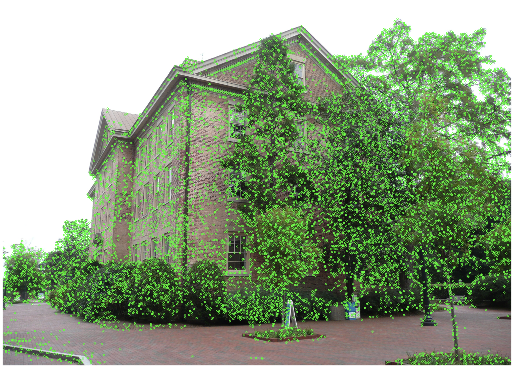
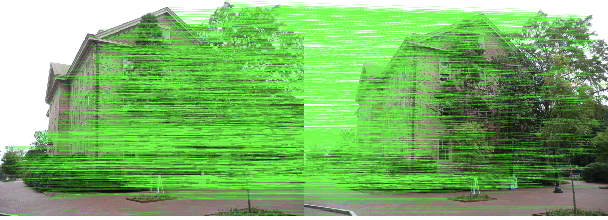
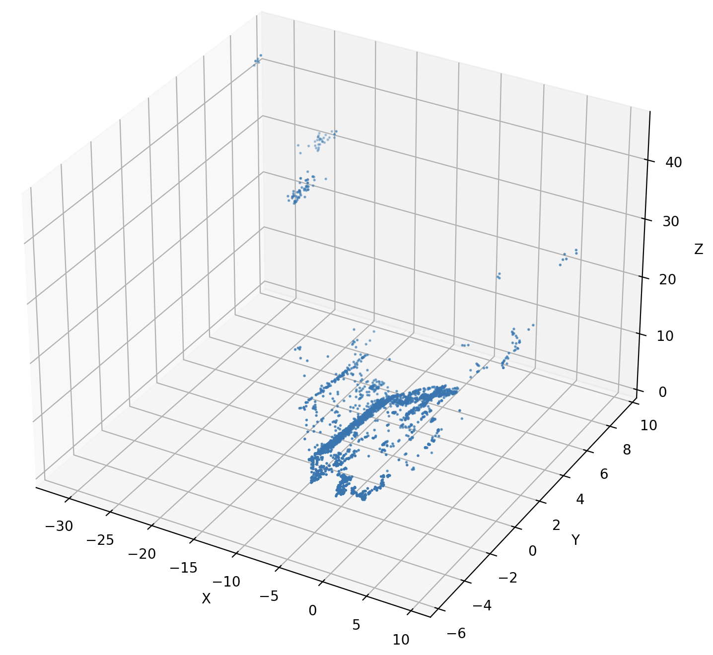

# SFM: Structure From Motion

This repository provides a simple Structure-from-Motion (SFM) pipeline.

## Installation

```
pip install -r requirements.txt
```

## Demo

To run the demo and see the pipeline in action:

```
python demo.py
```

## Sample Output

<div style="display: flex; overflow-x: auto; white-space: nowrap;">
    <div style="flex: 0 0 auto; margin-right: 10px;">
        <p>1. Feature Extraction</p>
        
    </div>
    <div style="flex: 0 0 auto; margin-right: 10px;">
        <p>2. Feature Matching</p>
        
    </div>
    <div style="flex: 0 0 auto;">
        <p>3. Sparse Reconstruction</p>
        
    </div>
</div>
